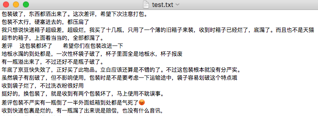
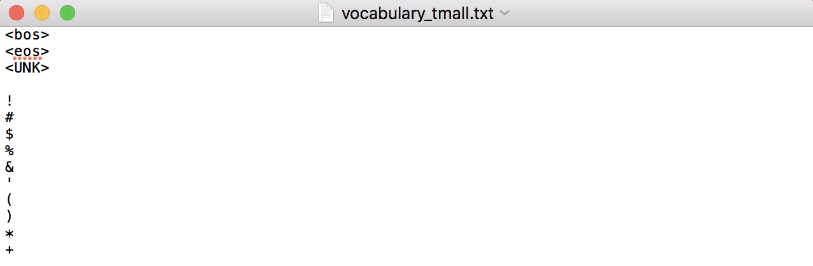
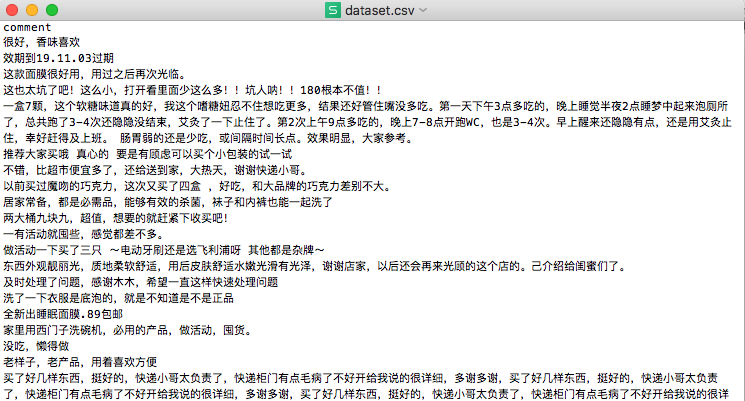

# Transformer-XL: 中文实验

论文 & github代码链接：
>[Transformer-XL: Attentive Language Models Beyond a Fixed-Length Context](http://arxiv.org/abs/1901.02860)
>
>https://github.com/kimiyoung/transformer-xl

## TensorFlow代码使用

- Source code在tf/目录下，已实现在多个GPU上训练模型以及多线程预测句子概率
- 如需使用代码进行 数据预处理/模型训练/句子概率预测，需要先cd进入tf/目录底下，调用tf/scripts/目录下的**product_review_base_gpu.sh**脚本(原因是代码中有相对路径)；如需要 数据集训练/调整参数，只需要基于脚本**product_review_base_gpu.sh**进行调整修改

### 数据集准备

* 数据清洗根据实际需要进行，无特别要求
* 样本数据写于.txt文件，每一行文本代表一个样本文档(document: 可以是一句话，也可以是一篇文章)
* 数据集必须拆分成train.txt/valid.txt/test.txt三个文件，放置于data/**XXX**/目录下(**XXX**是对应数据集名称，最好与全局参数FLAGS.dataset一致)。比如，用商品评论进行训练，则数据放置于data/product_review/目录下，全局参数FLAGS.dataset设置为"product_review"(此处为沿用原作者设置，如有需要可以更改)

### 数据预处理

*脚本调用命令(在tf/目录下，下面命令都要在tf/目录下执行)：*

* `bash scripts/product_review_base_gpu.sh train_data`
* `bash scripts/product_review_base_gpu.sh test_data`

*这两行命令作用为:*

* 将train.txt/valid.txt与test.txt中数据转化为**.tfrecords**文件用于后续训练与测试

* **如果在脚本product_review_base_gpu.sh中不设置vocab_dir参数(默认为None)**，则完成语料编码后在tf/目录下生成vocabulary_**XXX**.txt文本文件 (**XXX**为字典名称，代码中设置为全局变量FLAGS.dataset对应值)

  

  (一行一个token，前面几行一般为特殊字符如<bos> <eos> <UNK>)

* **如果在脚本product_review_base_gpu.sh中设置vocab_dir参数**，则读取文本建立字典类对象

*主要代码改动:*

* vocabulary.py: 将原本的**英文分词改为中文分词-Vocab.tokenize()**；**增加基于中文标点的中文分句Vocab.sent_token_split**；**增加将字典写入指定目录下.txt的方法Vocab.save_vocab**

*要留意的参数:*

* tgt_len: 每次训练中，每个样本的预测序列长度(如果设置tgt_len过小，则遍历一次语料需要的步数&时间就会变长)
* min_freq: 筛选低频词的阈值，某词在语料中出现频率低于该值时则不会被加入字典(设置最低频率可有效去除生僻字，可以缩短softmax步骤的时间)

### 模型训练

*调用脚本:*

* `bash scripts/product_review_base_gpu.sh train`

*要留意的参数:*

* div_val: 当该参数大于1，就会降低低频词的embedding维度(维度除div_val)；该参数可加快计算(未实验对比过效果)，如无特殊要求，一般设置为1
* untie_r: 决定是否绑定r_w_bias与r_r_bias这两个变量，如果绑定则减少参数个数加快训练(未实验对比过效果)
* d_model, n_head, d_head, n_layer: 分别为transformer的输出维度／head个数／每个head的维度／transformer层数(模型复杂度主要因素)
* mem_len: 缓存序列表征的长度，即每步训练预测中，前面多少个token的隐层输出会被缓存下来用于预测
* tgt_len: 与**数据预处理**中的tgt_len意义一样，且要保证在**模型训练**与**数据预处理**中，这个参数的值要一致
* train_steps: 根据实验经验，10m的中文语料训练到80,000步时pplx仍未收敛，建议定为原作者设定的100,000

### 句子困惑度预测

`bash scripts/product_review_base_gpu.sh sent_ppl`

要预测的数据存为.csv文件，第一列必须为待预测文本，文件路径在参数`input_file_dir`设置。输出结果写在`output_file_dir`指定文件中。

*要留意的参数:*

* mem_len: 缓存序列表征的长度，即每步预测中，前面多少个token的隐层输出会被缓存下来用于预测；该值不必要跟模型训练时的mem_len一样，可自行调整
* limit_len: 限定分句编码后的输入序列长度，即分句编码后序列长度大于该值则截断／小于则用0补齐
* pred_batch_size: 批量预测的batch size
* multiprocess: 子进程数量；注意: 由于每次要加载的模型参数&缓存隐层输出要占用一定显存，请注意子进程数目(实验经验，42902716个参数&mem_len为15，每个子进程需要759m的显存)

*输出格式:*

每行文本包含三个输出要素，依次为，输入文本(已截断或补齐)／log-probability／log-probability/len(encoded_input)

*注:* **predict_ref.py**中的预测方法单纯使用并发提速，可用于对比predict.py中同时采用并发与批量预测的方法

## 原作者的实验成果

截至2019.06.02: 

"Transformer-XL achieves new state-of-the-art results on multiple language modeling benchmarks. Transformer-XL is also the first to break through the 1.0 barrier on char-level language modeling. Below is a summary."

Method | enwiki8 | text8 | One Billion Word | WT-103 | PTB (w/o finetuning)
-- | -- | -- | -- | -- | -- 
Previous Best | 1.06 | 1.13 | 23.7 | 20.5 | 55.5
Transformer-XL | **0.99** | **1.08** | **21.8** | **18.3** | **54.5**
